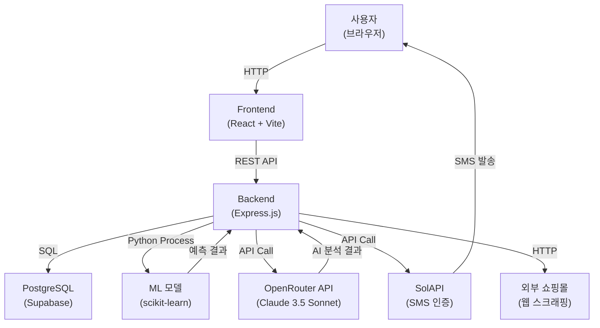

# 여기몰까

온라인 쇼핑몰의 신뢰도를 AI와 머신러닝으로 분석하여 소비자 피해를 예방하는 웹 플랫폼

## 데모

- **라이브 데모**: https://www.ygmk.app/
- **GitHub**: [레포지토리 URL]

## 문제 정의 / 목표

### 문제
온라인 쇼핑 시 가짜 리뷰, 피싱 사이트, 신뢰할 수 없는 쇼핑몰로 인한 소비자 피해가 증가하고 있습니다.

### 목표
- URL 기반 실시간 피싱 탐지 (ML 모델)
- 리뷰 신뢰도 AI 분석 (Claude 3.5 Sonnet)
- 사용자 제보 기반 피해 사례 데이터베이스 구축
- 0~100점 신뢰도 점수 제공

## 주요 기능

1. **쇼핑몰 신뢰도 분석**
   - URL 정규화 및 웹 스크래핑
   - Random Forest ML 모델 기반 피싱 탐지 (9가지 특징 추출)
   - SSL 인증서 검증, 리다이렉트 체인 추적, 도메인 연령 분석
   - 기술적 위험도 0~100점 변환

2. **리뷰 신뢰도 AI 분석**
   - Claude 3.5 Sonnet (OpenRouter API) 기반 분석
   - 6가지 판별 기준: 균형 없는 평가, 동일 패턴, 시간대 편중, 과도한 극단 표현, 구체적 경험 부족, 비정상 평점 분포
   - 배치 처리 (15개씩)로 API 호출 최적화
   - 5분 캐싱으로 성능 향상

3. **피해 사례 제보**
   - 7가지 카테고리 신고 (배송 문제, 상품 불일치, 환불 문제, 사기/피싱 등)
   - 증빙 자료 업로드 (최대 10개, PNG/JPG, 10MB 이하)
   - 관리자 승인제

4. **커뮤니티**
   - 게시판 (작성/수정/삭제, 좋아요, 댓글)
   - 조회수 자동 증가

5. **사용자 인증 및 관리**
   - SMS 인증 필수 회원가입 (SolAPI)
   - JWT 기반 인증 (7일 만료)
   - 관리자 대시보드 (Recharts 통계 차트)
   - PostgreSQL Full-Text Search 기반 검색

## 기술 스택

### Frontend
- React 18.3.1 + TypeScript 5.5.4
- Vite 5.4.0
- React Router 6.26.2
- Tailwind CSS 3.4.1
- shadcn/ui
- Recharts 3.4.1

### Backend
- Node.js + Express.js 5.1.0
- Supabase (PostgreSQL)
- JWT 9.0.2
- Multer 2.0.2 (파일 업로드)
- Nodemailer 7.0.9 (이메일)
- SolAPI (SMS 인증)

### AI/ML
- OpenRouter API (Claude 3.5 Sonnet)
- Python scikit-learn (Random Forest)
- Node-Fetch (웹 스크래핑)

### Infra/Deploy
- GitHub Actions (CI/CD)
- Docker
- GCP (Google Cloud Platform)
- Supabase

## 시스템 구성도



## 빠른 시작

### 요구사항

- Node.js 20 이상
- Python 3.9 이상
- PostgreSQL (또는 Supabase 계정)
- npm 또는 yarn

### 로컬 실행

#### 1. 저장소 클론

```bash
git clone [레포지토리 URL]
cd CapstoneProject
```

#### 2. Backend 설정

```bash
cd my-react-app/backend

# 의존성 설치
npm install

# Python ML 환경 설정
cd ml
python -m venv .venv-ml
# Windows
.venv-ml\Scripts\activate
# Linux/Mac
source .venv-ml/bin/activate

# Python 패키지 설치
pip install -r requirements.txt
cd ..
```

#### 3. 환경변수 설정

`my-react-app/backend/.env` 파일 생성:

```env
# Supabase
SUPABASE_URL=https://your-project.supabase.co
SUPABASE_KEY=your-supabase-anon-key
SUPABASE_SERVICE_ROLE_KEY=your-service-role-key

# JWT
JWT_SECRET=your-jwt-secret-key-change-in-production
JWT_EXPIRES_IN=7d

# SMS (SolAPI)
SOLAPI_KEY=your-solapi-key
SOLAPI_SECRET=your-solapi-secret
SOLAPI_FROM_NUMBER=01012345678

# OpenRouter (AI 분석)
OPENROUTER_API_KEY=your-openrouter-api-key

# Email (선택)
GMAIL_USER=your-email@gmail.com
GMAIL_APP_PASSWORD=your-app-password

# Server
PORT=3001
NODE_ENV=development
```

#### 4. 데이터베이스 설정

Supabase 대시보드에서 `complete-schema.sql` 실행하거나, 마이그레이션 실행:

```bash
# 마이그레이션 파일 확인
ls migrations/
```

#### 5. Backend 실행

```bash
cd my-react-app/backend
npm run dev
```

서버는 `http://localhost:3001`에서 실행됩니다.

#### 6. Frontend 설정

```bash
cd my-react-app/frontend

# 의존성 설치
npm install

# 환경변수 설정 (필요시)
# .env 파일 생성 (API 엔드포인트 등)

# 개발 서버 실행
npm run dev
```

프론트엔드는 `http://localhost:5173`에서 실행됩니다.

### Docker 실행

```bash
# Backend Docker 빌드 및 실행
cd my-react-app/backend
docker build -t ygmk-backend .
docker run -p 3001:3000 --env-file .env ygmk-backend
```

### 테스트

```bash
cd my-react-app/backend
npm test
```

## 환경변수

| 변수명 | 설명 | 예시 |
|--------|------|------|
| `SUPABASE_URL` | Supabase 프로젝트 URL | `https://xxx.supabase.co` |
| `SUPABASE_KEY` | Supabase Anon Key | `eyJhbGciOiJIUzI1NiIsInR5cCI6IkpXVCJ9...` |
| `SUPABASE_SERVICE_ROLE_KEY` | Supabase Service Role Key | `eyJhbGciOiJIUzI1NiIsInR5cCI6IkpXVCJ9...` |
| `JWT_SECRET` | JWT 토큰 서명 키 | `your-secret-key-change-in-production` |
| `JWT_EXPIRES_IN` | JWT 만료 시간 | `7d` |
| `SOLAPI_KEY` | SolAPI API Key | `your-solapi-key` |
| `SOLAPI_SECRET` | SolAPI API Secret | `your-solapi-secret` |
| `SOLAPI_FROM_NUMBER` | 발신 번호 | `01012345678` |
| `OPENROUTER_API_KEY` | OpenRouter API Key | `sk-or-v1-xxx...` |
| `GMAIL_USER` | Gmail 계정 (선택) | `your-email@gmail.com` |
| `GMAIL_APP_PASSWORD` | Gmail 앱 비밀번호 (선택) | `xxxx xxxx xxxx xxxx` |
| `PORT` | 서버 포트 | `3001` |
| `NODE_ENV` | 환경 모드 | `development` |

## 폴더 구조

```
CapstoneProject/
├── my-react-app/
│   ├── frontend/          # React + TypeScript
│   │   ├── src/
│   │   └── package.json
│   │
│   └── backend/           # Express.js
│       ├── config/        # Supabase 설정
│       ├── controllers/   # 컨트롤러
│       ├── middleware/    # 미들웨어
│       ├── routes/        # 라우터
│       ├── services/      # 비즈니스 로직
│       ├── utils/         # 유틸리티
│       ├── ml/            # Python ML 모델
│       │   ├── predict.py
│       │   ├── best_model.pkl
│       │   └── requirements.txt
│       ├── migrations/   # DB 마이그레이션
│       ├── tests/         # 테스트
│       ├── uploads/       # 업로드 파일
│       ├── server.js
│       └── package.json
│
└── README.md
```

## 내 기여 (Contribution)

### 프론트엔드
- React + TypeScript로 18개 페이지 전체 구현
- shadcn/ui 기반 컴포넌트 설계 및 다크/라이트 테마 지원
- Recharts를 활용한 관리자 대시보드 차트 구현
- 반응형 디자인 (모바일/태블릿/데스크톱)

### 백엔드
- Express.js 기반 RESTful API 설계 및 구현 (30개 이상 엔드포인트)
- JWT 인증 시스템 구축
- 파일 업로드 (Multer) 및 SMS/이메일 서비스 연동
- PostgreSQL Full-Text Search 기반 검색 시스템 구현

### AI/ML
- Python scikit-learn Random Forest 모델 학습 및 배포
- Node.js와 Python 프로세스 간 통신 구현
- Claude 3.5 Sonnet API 연동 및 프롬프트 엔지니어링
- 배치 처리 최적화 (15개씩) 및 캐싱 시스템 (5분)

### 데이터베이스
- PostgreSQL 14개 테이블 설계 및 정규화
- 인덱싱 최적화 및 관계형 데이터 모델링
- Full-Text Search 인덱스 설정

### 인프라
- GitHub Actions CI/CD 파이프라인 구축
- Docker 컨테이너화

## 트러블슈팅 / 의사결정

### 1. Node.js와 Python 프로세스 간 통신

**이슈**: ML 모델 예측을 위해 Node.js에서 Python 스크립트를 실행해야 함. Windows/Linux 환경 호환성 문제.

**해결**:
- `spawn`을 사용한 프로세스 통신
- 가상환경 Python 경로 자동 감지 (`.venv-ml` 우선, 없으면 시스템 Python)
- JSON 기반 STDIN/STDOUT 통신
- 타임아웃 및 에러 핸들링

### 2. OpenRouter API 비용 최적화

**이슈**: 리뷰가 많을 때 API 호출 비용이 급증.

**해결**:
- 리뷰를 15개씩 배치 처리하여 호출 횟수 최소화
- 분석 결과를 5분간 캐싱 (DB에 저장)
- 동일 쇼핑몰 재분석 시 캐시 우선 사용

### 3. PostgreSQL Full-Text Search 한국어 지원

**이슈**: 기본 Full-Text Search는 영어 중심, 한국어 검색 품질 저하.

**해결**:
- `pg_trgm` 확장 사용 (삼각함수 기반 유사도)
- `to_tsvector('simple', column)` 사용하여 형태소 분석기 우회
- 인덱스 최적화 (`GIN` 인덱스)

## 라이선스

ISC

---

## (부록) 면접 질문 5개 + 답변 초안

### 1. 이 프로젝트에서 가장 어려웠던 기술적 도전은 무엇이었나요?

**답변**: Node.js와 Python ML 모델 간 통신이 가장 어려웠습니다. 특히 Windows/Linux 환경 호환성과 프로세스 에러 핸들링이 까다로웠습니다. 가상환경 Python 경로 자동 감지 로직을 구현하고, JSON 기반 STDIN/STDOUT 통신으로 해결했습니다.

### 2. AI 분석 비용을 어떻게 최적화했나요?

**답변**: OpenRouter API 호출 비용을 줄이기 위해 배치 처리(15개씩)와 캐싱(5분)을 적용했습니다. 동일 쇼핑몰 재분석 시 DB 캐시를 우선 사용하여 불필요한 API 호출을 방지했습니다.

### 3. 신뢰도 점수 계산 로직을 설명해주세요.

**답변**: 기술적 위험도(ML 모델 예측), 리뷰 신뢰도(AI 분석), 피해 사례 제보(관리자 승인 후 가중치)를 종합하여 0~100점으로 변환합니다. 각 요소는 가중치를 두어 최종 점수를 산출합니다.

### 4. 보안 측면에서 어떤 조치를 취했나요?

**답변**: JWT 토큰 기반 인증, SMS 인증 필수 회원가입, 파일 업로드 검증(PNG/JPG만, 10MB 제한), XSS/SQL 인젝션 방지, 레이트 리밋 적용을 구현했습니다.

### 5. 이 프로젝트를 개선한다면 무엇을 하시겠어요?

**답변**: 
1. ML 모델 성능 향상 (더 많은 학습 데이터, 하이퍼파라미터 튜닝)
2. 실시간 알림 시스템 (WebSocket)
3. 크롬 확장 프로그램 개발 (브라우저에서 실시간 신뢰도 표시)
4. 모바일 앱 개발 (React Native)
5. 공공 데이터 연동 (사업자등록번호 검증 API)
